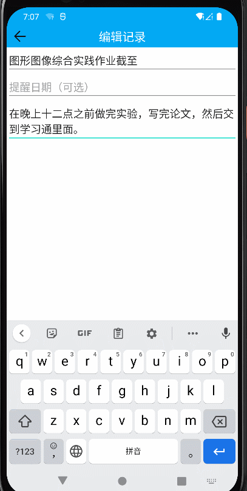
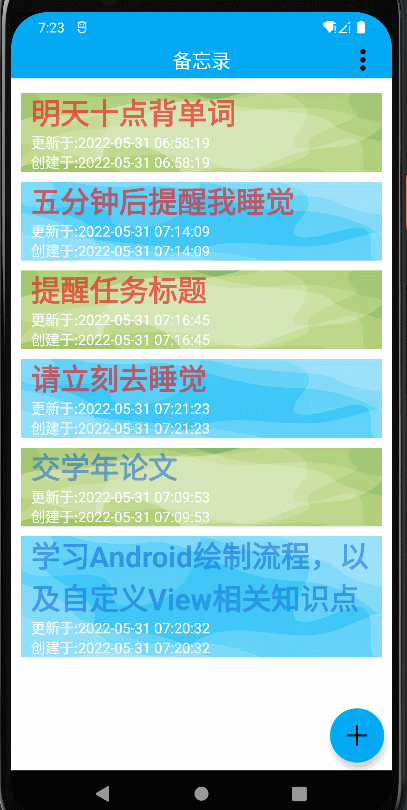
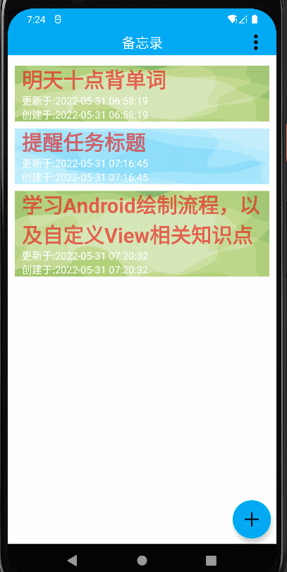
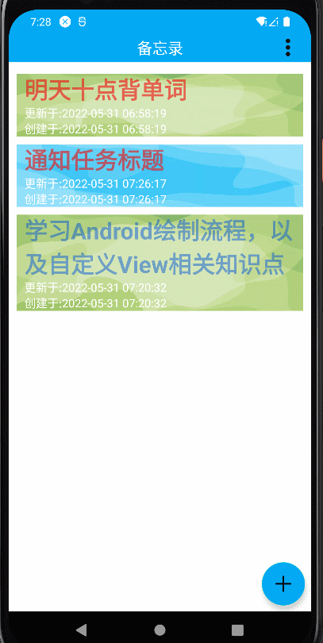

# notepad
一个简单简洁的备忘录app
# 实现功能
### 任务记录可以增删改查，使用数据库保存。
### 每条任务记录有标题、内容、创建时间、修改时间，任务执行时间点（选填）。
### 展示列表可以进入编辑模式，可以多选删除。每条记录也可以长按弹窗确认删除。
### 任务执行时间到达时发push通知提醒。过期的任务在列表中置顶标红展示。
# 功能展示
## 查看任务

## 创建记录

## 多选删除

## 长按删除

## 通知

# 亮点技术
### 使用kotlin语言特性（使用内联扩展函数创建弹窗，Object修饰单例类实现工具类），优化代码结构，增强可读性
### 使用AlarmManager定时任务系统，实现唤醒Service进行消息通知的功能，保证了无论应用或者手机处于什么状态都能发送通知
### 采用悬浮操作按钮，在查看列表和多选删除两个模式中，通过变换按钮图标以及点击事件，实现了一个按钮的功能复用，让产品更加简洁